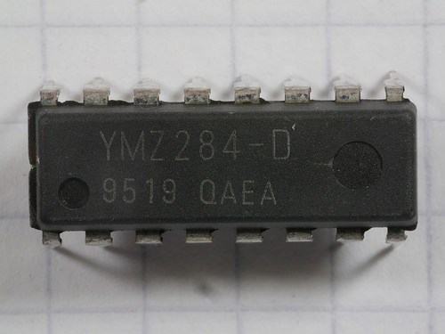

# testYMZ284
The Yamaha YMZ284 is a 16-pin chip which has the same function and register-level interface as the General Instruments
[AY-3-8910](https://en.wikipedia.org/wiki/General_Instrument_AY-3-8910 "Wikipedia: General Instrument AY-3-8910").
The YMZ284, though, is smaller and has a simpler bus interface.
Unlike the AY-3-8910, it is write-only; register contents may not be read back.

This Arduino sketch tests a YMZ284 chip by setting up some initial configuration and generating sounds.
The Arduino's ADC (analog-to-digital converter) is used, along with a pot, to control the sound generator.

## YMZ284 Chip

